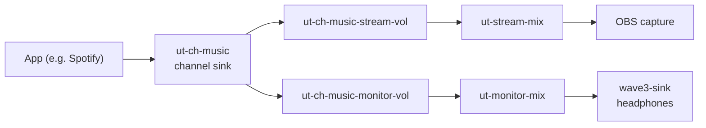

# Undertone Development Progress

> Archived. This document records the final state of the `undertone` branch and is no longer updated. Development continues in the LibreWave rewrite on the main branch.

---

## Final state

The daemon and the UI are functional. Volume, mute, app routing, profiles, and output device selection work end to end. The features below were never finished and are listed under "What is not implemented".

### What works

- Volume control per channel and per mix, applied to PipeWire filter nodes
- Mute per channel and per mix
- Master volume and mute for the stream and monitor mixes
- App routing by rule, applied immediately when an app appears
- Routing persistence in SQLite
- Profiles: save, load, and restore at daemon startup
- Monitor output selection
- Wave:3 detection over USB
- Mic gain and mute through ALSA
- Qt6/QML interface with three tabs (Mixer, Apps, Device)

### What is not implemented

- **VU meters** - Channel levels are always zero. No monitor streams are set up.
- **Native HID control** - The Wave:3 HID protocol was never reverse engineered. Mic control shells out to `amixer`.
- **Graph reconciliation** - The Reconcile command does nothing. If PipeWire restarts, the daemon needs a restart.
- **Event subscriptions** - Subscribe and Unsubscribe accept requests, but the server ignores them and sends all events to all clients.
- **Diagnostics** - GetDiagnostics returns basic node and link counts only.
- **Profile delete in the UI** - The IPC command exists, but the UI has no control for it.
- **Mic state sync** - The UI sets mic state optimistically and never reads it back from the daemon.
- **Config file use** - `~/.config/undertone/config.toml` is read at startup, but its values are not used.

---

## Audio routing chain



---

## Known issues

- The Wave:3 hardware mute button does not sync with the app.
- cxx-qt methods keep snake_case names in QML.
- `channel_state` is seeded in the database but not updated at runtime. Volume changes persist only inside profiles.
- The `device_settings` and `event_log` tables exist but are never used.
- DaemonEvent, LinkParams, and the legacy NodeFactory, monitor, and reconciler modules are dead code.

---

## Project structure

```
Undertone/
├── Cargo.toml                    # Workspace root
├── PROGRESS.md                   # This file
├── README.md                     # User documentation
├── crates/
│   ├── undertone-daemon/         # Daemon binary
│   ├── undertone-core/           # Business logic
│   ├── undertone-pipewire/       # PipeWire integration
│   ├── undertone-db/             # SQLite persistence
│   ├── undertone-ipc/            # IPC protocol
│   ├── undertone-hid/            # Wave:3 detection, ALSA mic control
│   └── undertone-ui/             # Qt6/QML UI
└── scripts/                      # Install, udev rules, service, WirePlumber config
```

---

## System requirements

| Component    | Version     |
| ------------ | ----------- |
| OS           | Linux       |
| PipeWire     | 1.4.9+      |
| WirePlumber  | 0.5.12+     |
| Rust         | 1.92+       |
| Qt           | 6.x         |
| Wave:3       | VID 0x0fd9, PID 0x0070 |

---

## Milestones

| Milestone        | Status     | Notes                                    |
| ---------------- | ---------- | ---------------------------------------- |
| Foundation       | Complete   | Workspace, PipeWire connection, SQLite, IPC socket |
| Virtual channels | Complete   | 5 channel sinks, 2 mix nodes, Wave:3 detection |
| Mix routing      | Complete   | Channel-to-mix links, volume filters     |
| IPC protocol     | Complete   | JSON protocol over a Unix socket         |
| UI framework     | Complete   | Qt6/QML, channel strips                  |
| App routing UI   | Complete   | Active apps list, route assignment       |
| Device panel     | Complete   | Connection status, mic controls          |
| Profiles         | Complete   | Save, load, restore at startup           |
| Wave:3 HID       | Not done   | ALSA fallback only                       |
| VU meters        | Not done   | Never implemented                        |

---

## Dependencies

```toml
tokio = "1.42"
pipewire = "0.9"
libspa = "0.9"
serde = "1.0"
serde_json = "1.0"
rusqlite = "0.32"
cxx-qt = "0.7"
cxx-qt-lib = "0.7"
tracing = "0.1"
parking_lot = "0.12"
```
