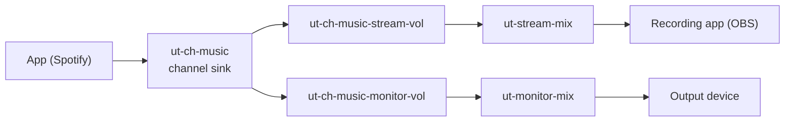

# Undertone

Linux-native audio mixer for the Elgato Wave:3, built on PipeWire.

Undertone gives you independent control over five audio channels, each with its own stream and monitor mix. It is aimed at streamers and content creators on Linux. The Wave:3 is optional; Undertone also works as a general audio mixer.

> [!IMPORTANT]
> This branch is archived. Undertone was an AI-authored experiment, written entirely by Claude Opus 4.5. Development continues in the LibreWave rewrite on the [main](https://github.com/zhgmx/LibreWave/tree/main) branch.

## Features

- Five channels: System, Voice, Music, Browser, Game
- Separate stream and monitor mixes per channel, each with its own volume and mute
- Master volume and mute for each mix
- Automatic app routing by rule. Discord goes to Voice, Spotify goes to Music, and so on
- Profiles: save and load mixer settings, with the default profile restored at startup
- Monitor output selection: route the monitor mix to any output device
- Mic gain and mute for the Wave:3, over ALSA
- Qt6/QML interface with Kirigami styling

## Audio routing

Undertone creates virtual sinks in PipeWire. Applications connect to their channel sink. Each channel feeds two volume filters, one per mix.



### Default app routing

| Pattern   | Channel |
| --------- | ------- |
| discord   | Voice   |
| zoom      | Voice   |
| teams     | Voice   |
| spotify   | Music   |
| rhythmbox | Music   |
| firefox   | Browser |
| chromium  | Browser |
| chrome    | Browser |
| steam     | Game    |
| _default_ | System  |

## Usage

### Mixer tab

- Drag the sliders to set channel volume.
- Press the mute button to silence a channel.
- Switch between the stream and monitor mix.
- Use the master controls for the whole mix.

### Apps tab

- See which applications are playing audio.
- Pick a channel from the dropdown to reassign an app.
- The route saves automatically.

### Device tab

- See the Wave:3 connection status and serial number.
- Adjust microphone gain and mute.
- Choose the output device for the monitor mix.

### Profiles

- Pick a profile from the header menu.
- Use the header menu to save the current settings.

## Build and run

You need Rust 1.92+ and Qt6. No installation method is provided for this archived branch.

```bash
cargo run -p undertone-daemon
# in another terminal
cargo run -p undertone-ui
```

## Configuration

Data lives in `~/.local/share/undertone/`:

- `undertone.db` - SQLite database with channels, routes, and profiles

The daemon listens on `$XDG_RUNTIME_DIR/undertone/daemon.sock`.

WirePlumber configuration for Wave:3 naming:

- `~/.config/wireplumber/wireplumber.conf.d/51-elgato.conf`

## Troubleshooting

### No audio from channels

```bash
# Is the daemon running?
pgrep undertone-daemon

# Do the PipeWire nodes exist?
pw-cli list-objects Node | grep ut-

# Are the links in place?
pw-link -l | grep ut-
```

### App routing to the wrong channel

```bash
# Check the stored routes
sqlite3 ~/.local/share/undertone/undertone.db "SELECT * FROM app_routes;"

# Restart the daemon to re-apply routes
pkill undertone-daemon && cargo run -p undertone-daemon
```

### UI cannot connect

```bash
# Does the socket exist?
ls -la $XDG_RUNTIME_DIR/undertone/daemon.sock

# Test the IPC
echo '{"id":1,"method":{"type":"GetState"}}' | \
    socat - UNIX-CONNECT:$XDG_RUNTIME_DIR/undertone/daemon.sock
```

## Status

What works and what does not:

- Volume, mute, app routing, profiles, and output device selection work end to end.
- Mic control uses ALSA. Native HID control of the Wave:3 is not implemented.
- There are no VU meters.
- Graph reconciliation is not implemented. If PipeWire restarts, restart the daemon.

## Architecture

**undertone-daemon** runs as a background service. It handles the Unix socket, signals, and the event loop (Tokio).

- **undertone-core** - channels, mixer, app routing, profiles, state
- **undertone-pipewire** - PipeWire graph management
- **undertone-db** - SQLite persistence
- **undertone-ipc** - JSON protocol over the Unix socket
- **undertone-hid** - Wave:3 detection and ALSA mic control

**undertone-ui** is a Qt6/QML interface built with cxx-qt and Kirigami.

## License

MIT - see [LICENSE](LICENSE).

## Acknowledgments

- [pipewire-rs](https://gitlab.freedesktop.org/pipewire/pipewire-rs) - Rust bindings for PipeWire
- [cxx-qt](https://github.com/KDAB/cxx-qt) - Rust/Qt interop
- [KDE Kirigami](https://develop.kde.org/frameworks/kirigami/) - UI framework
- Elgato for the Wave:3 hardware
