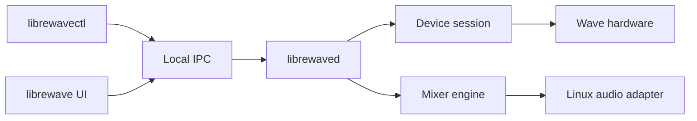

# Architecture

Status: approved baseline for the Linux implementation.

## Product boundary

LibreWave is a user-session audio service with two clients. The daemon owns the hardware, audio graph, saved state, and recovery process. The CLI and desktop application send commands to the daemon and subscribe to state changes.

This split lets the microphone and mixer continue to work when the desktop window is closed. It also keeps one normal hardware writer.

The local interface uses a Unix domain socket under the user's runtime directory. It does not listen on a network interface. The daemon checks the connecting process credentials and versions every request and event.

## Workspace boundaries

| Package | Responsibility | Must not contain |
| --- | --- | --- |
| `librewave-protocol` | Message schemas, codecs, field validation, generated protocol catalog | USB I/O, device policy, platform APIs |
| `librewave-device` | Device capabilities, exact-version sessions, state shadow, safe transactions | libusb, ALSA, PipeWire, UI code |
| `librewave-core` | Profiles, commands, events, channel identifiers, mix semantics | USB packets, platform object identifiers |
| `librewave-engine` | Audio graph semantics, DSP, metering, bounded control transfer | GUI state, blocking I/O, hardware policy |
| `librewave-ipc` | Versioned requests, responses, snapshots, subscriptions, errors | Device access, storage, platform APIs |
| `librewave-platform-linux` | USB transport, udev, ALSA, PipeWire, WirePlumber, hotplug | Product UI, cross-platform policy |
| `librewave-ui` | GPUI views, input handling, accessible controls | USB, ALSA, PipeWire, persistent authority |
| `librewaved` | Composition root, authority, reconciliation, recovery | Duplicated protocol or DSP logic |
| `librewavectl` | Complete command-line client, setup, diagnostics | A second hardware write path |
| `librewave` | Optional GPUI application | Required headless functionality |

Crates enter the workspace when they have a real contract and tests. The repository will not create empty platform crates as promises of future support.

## Dependency direction

`librewave-protocol` and `librewave-core` are the lowest layers. Device sessions depend on the protocol crate. The engine depends on core types. IPC depends on the stable command and event vocabulary in the core crate.

The Linux platform crate implements transport and audio-host traits. It may depend on the portable contracts, but portable crates do not depend on it.

The daemon composes these parts. The UI and CLI depend on IPC types and client code, not daemon internals.

## State ownership

The daemon maintains one desired state and one observed state for each managed device and audio graph.

- Desired state comes from the active profile and accepted user commands.
- Observed state comes from device reads, device events, and Linux audio events.
- Reconciliation compares the two states and schedules bounded changes.
- A successful write updates observed state only after readback or a trusted device event.
- A failed write leaves desired state intact and reports the mismatch.
- Each control event records whether it came from the device, a LibreWave client, or the operating system. Reconciliation does not send a change back to its origin.

The UI and CLI receive immutable snapshots followed by ordered events. They do not keep an independent authoritative device model.

## Device adoption

On first adoption, LibreWave reads the current device state and stores it as the initial profile. It does not reset the microphone to project defaults.

After adoption, the profile is authoritative while the daemon runs. Physical knob, mute, and touch events are user input. The daemon records them in observed state, applies the product rule for that control, and persists the resulting desired state.

An explicit unmanage operation releases the audio graph and restores setup files that LibreWave replaced. Setup does not change Gain Lock, so unmanage does not restore a saved Gain Lock value.

## Restart behavior

The daemon models startup, device reconnect, PipeWire restart, WirePlumber restart, and shutdown as state transitions. Recovery reuses the same reconciliation path as initial startup.

The daemon must not alternate between two competing graph layouts or repeatedly fight another volume owner. If the required ownership cannot be obtained, it reports the conflict and leaves hardware writes stopped.

## Installation ownership

`librewavectl` owns setup, verification, and removal. It records every installed path, backup, service unit, and policy file in one installation manifest. Setup stages a complete new installation, validates it, switches the active link atomically, and removes superseded LibreWave-owned files.

The current setup installs the exact Wave:3 udev access rule and an inactive read-only daemon unit. It does not install the WirePlumber card-disable rule, enable the unit, start the daemon, or take audio ownership. These actions stay blocked until the production ALSA and PipeWire host is ready.

Uninstall removes only unmodified, manifest-owned paths and restores exact user files from verified backups. It preserves profiles by default. An explicit, confirmed purge removes profiles. Setup does not change Gain Lock or other hardware settings, so uninstall has no hardware value to restore.

Development commands build the current checkout and call the same installer. They do not maintain a separate development installation path. See [Setup and removal](setup.md).

## Pre-release evolution

Before the first public release, the repository supports one current configuration schema, one IPC version, one command vocabulary, and one installation layout. The lifecycle refuses an unknown schema. A breaking development change replaces the only supported test layout instead of adding an adapter for an older development build.

Compatibility migrations begin only when a public release creates state that users need to keep.

## Platform precedent

Windows, macOS, and Linux use different audio APIs and virtual-device mechanisms. LibreWave shares the device model, mixer semantics, profiles, commands, and user-visible behavior where the evidence supports it. Each platform owns its audio graph and lifecycle code.

The project does not treat a shared implementation detail as a compatibility requirement. It records behavior at the operating-system boundary and reproduces that behavior through the native Linux stack. See [Wave Link behavior parity](behavior-parity.md).
