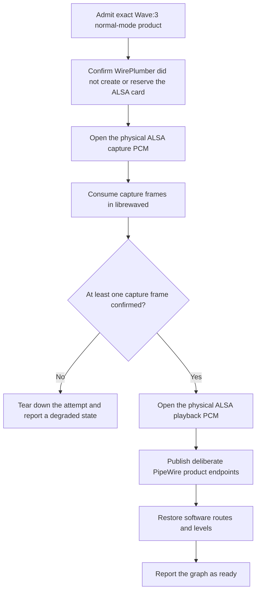

# Linux audio integration

Status: the direct host owns ALSA resources and inspects PipeWire through the safe Rust wrappers. Product endpoint processing and live validation are not implemented.

## Reference system

The first test system uses Fedora 44, PipeWire 1.6, WirePlumber 0.5, KDE Plasma, and a Wave:3. Tests cover Wayland and X11 where desktop behavior differs.

## Validated ownership boundary

Some Wave microphones produce silent capture when playback starts before capture. A local workaround confirmed the required order by keeping capture active through a null sink and creating replacement playback and capture endpoints. A sanitized read-only PipeWire inspection confirmed that the null sink appears in the ordinary sink list beside the replacement endpoints. That workaround is useful evidence, but it is not the product design. A Lua script owns its lifecycle.

LibreWave uses one physical audio owner. `librewaved` will open the Wave:3 ALSA capture PCM directly, consume capture frames, confirm that capture is active, and then open the playback PCM. WirePlumber must not create or reserve the admitted physical card. PipeWire will carry only the product endpoints that `librewave-core` defines.

`librewave-platform-linux` contains the policy artifacts, ordered lifecycle, and direct host. The host uses `alsa` 0.12.1 and `pipewire` 0.9.2. It is not connected to daemon startup, setup, or the running graph.

The host correlates an admitted USB candidate to one ALSA card. It requires one stable ALSA card identifier and one PCM device for each direction. It repeats the sysfs and procfs correlation immediately before each open. The open uses the revalidated card identifier, device number, and subdevice zero. A changed card number, identifier, topology, or PCM set stops startup.

The daemon must supply an exact physical PCM format. The host has no default sample rate, channel count, period size, or buffer size. It currently supports interleaved signed 32-bit little-endian samples. ALSA must apply the complete requested format without adjustment.

## WirePlumber policy

The Wave:3 policy renders `80-librewave-wave3.conf` as a WirePlumber 0.5 SPA-JSON fragment. Its one rule matches both exact normal-mode USB properties:

```text
device.vendor.id = "0x0fd9"
device.product.id = "0x0070"
```

The rule sets only `device.disabled = true`, which disables the exact card in the WirePlumber ALSA monitor. The fragment does not set `node.disabled`, create a node, load a component, or run a Lua script.

WirePlumber documents `device.disabled` as the property that removes a matched card or device. See the [WirePlumber ALSA configuration reference](https://pipewire.pages.freedesktop.org/wireplumber/daemon/configuration/alsa.html).

The rule has no serial, name, family, class, or regular-expression match. A different vendor ID or adjacent product ID does not match it. The current setup does not install or activate this rule. A future setup can install it only after the production audio host can take ownership. Hardware validation must then confirm that WirePlumber created no physical nodes and holds no reservation before `librewaved` takes ownership.

## Device access policy

The Wave:3 policy also renders `70-librewave-wave3.rules`. The udev rule matches the USB device object with vendor `0fd9` and product `0070`, then adds `TAG+="uaccess"`.

After it installs or removes this rule, the lifecycle reloads the udev rules. It then sends a change event only to normal-mode Wave:3 USB device objects with the same vendor and product values. It does not use a broad USB trigger. If the privileged rule or refresh operation fails, the lifecycle fails and does not claim that access is current. Rollback or journal recovery preserves or restores the prior rule state.

The rule does not use `MODE="0666"`. It does not match a USB class or interface, and it does not grant access to DFU or another product mode. `snd_usb_audio` stays bound during normal operation.

## Runtime ownership plan

The direct backend must follow this one startup path:



The daemon must not open playback when capture is inactive or has produced no frames. A failed step tears down objects from that attempt and reports a named degraded state. Recovery after hotplug or a PipeWire or WirePlumber restart uses the same sequence.

The lifecycle state machine enforces this order through one host trait. The production host configures and starts capture before its first bounded ALSA wait. Before the worker starts, the host allocates one buffer from the checked period size, channel count, and sample width.

The capture loop does not allocate or lock. Atomic counters report frames and recovered xruns. After ALSA recovers an xrun, the host restarts capture only if the PCM is prepared. It accepts a running PCM and fails for any other state. Timeout, disconnect, an unrecoverable PCM error, worker shutdown, and worker join have distinct outcomes. Playback cannot open until the worker has consumed at least one frame.

The host owns its PipeWire core connection, capture worker, and playback PCM. One idempotent teardown path disconnects PipeWire and closes both PCM resources. Its resource snapshot reports whether it owns a PipeWire connection resource. It also reports capture and playback activity, frame and xrun counts, deliberate endpoint identities, and the readiness boundary. The snapshot does not contain ALSA card numbers, PCM names, USB topology, or PipeWire object identifiers.

## Product endpoints

The desktop may see only deliberate product endpoints. The current `librewave-core` contract defines microphone, monitor mix, and stream mix as public sources. Future sink flows must enter that core contract before the Linux adapter publishes them.

The physical Wave capture and playback PCMs are not desktop endpoints. LibreWave must not publish a keepalive sink, null sink, raw helper source, duplicate physical Wave node, or another implementation object as an ordinary device. KDE, `wpctl status`, and PulseAudio-compatible listings form the visibility acceptance test. Low-level diagnostic tools may still show internal objects needed to inspect the graph.

The host connects to the user's existing PipeWire instance and completes a registry round trip. It checks the admitted candidate's exact ALSA card number. A Device global must have the Wave:3 vendor and product values, and its `api.alsa.card` value must identify that card. A Node global matches through the card component of `api.alsa.path`. Node globals do not need vendor or product properties. Startup fails while any matching Device or Node global remains visible.

Endpoint plans come only from `librewave-core`. The current plans are three PipeWire output streams with `media.class=Audio/Source`, `node.virtual=true`, and stable `librewave.*` names. The production adapter is not connected to `librewave-engine`. It therefore returns `engine unavailable` before it creates an endpoint. Playback remains prepared, not active, at this boundary. The adapter does not publish silence or report the graph as ready.

## Portable mixer contract

`librewave-engine` processes stereo interleaved 32-bit float audio at 48 kHz. Construction sets a portable logical source collection with a maximum of 12 sources. It also sets the microphone source and the maximum frames that one call can process. Each call can use a different frame count at or below that maximum. The Linux adapter is responsible for bridging ALSA periods and PipeWire quantum sizes to this contract.

Each source has separate monitor and stream routes. A route has an enabled value and a fader from -60.0 dB through +12.0 dB in 0.5 dB steps. The microphone endpoint receives the configured microphone source at unity. Monitor and stream route values do not change that endpoint. Hardware microphone gain, hardware microphone mute, and headphone level stay outside the engine.

The engine reports separate left and right peak and RMS values for each source and endpoint. It applies one complete pending control snapshot at the boundary before a nonzero block. Processing uses fixed-capacity state and does not allocate, free memory, lock, block, log, perform I/O, or call platform code.

## Mixer control plane

The current product profile has two logical sources. Source 1 is Microphone, and source 2 is System. Source 1 supplies the microphone endpoint. Each source starts with its monitor and stream routes enabled at 0 dB. Levels use integer half-decibel steps from -60 dB through +12 dB.

`librewaved` stores the desired profile in `librewave/profiles/mixer-state.json` under the selected configuration root. Schema 1 contains the mixer generation, microphone source, and the complete two-source profile. The daemon rejects unknown fields, unsupported schemas, changed source identities, and invalid fader steps. It does not read an older mixer format or add an Auxiliary source.

`librewavectl mixer show` reads the current snapshot. `librewavectl mixer set <source-id> <generation> <monitor|stream> <on|off> <level-db>` replaces one complete route. The daemon rejects a stale mixer generation or an unknown source. An unchanged route succeeds without a file write or generation change.

For a changed route, the daemon writes the complete desired profile to a temporary file, syncs it, renames it, and syncs the profile directory. It updates retained state only after all these steps succeed. If the directory sync fails after the rename, the command reports durability ambiguity and retained state does not advance. The destination can already contain the next complete profile. A retry with the retained generation writes the same next profile and converges the file and snapshot. On startup, the daemon strictly loads whichever complete file is present.

The mixer snapshot reports that the audio host and mixer engine are not connected. Meter values are unavailable. These controls are durable desired state only. They do not start ALSA, create PipeWire objects, enable the daemon service, or make the Linux audio graph ready.

## Volume ownership

The Linux audio graph keeps these values separate:

- Microphone preamp gain is a Wave hardware value.
- Headphone output level is a Wave hardware value.
- LibreWave endpoint, channel, and mix volumes are software values.
- A raw ALSA hardware mixer value is not a LibreWave endpoint value.

KDE may change the software volumes that LibreWave publishes. It must not use ALSA hardware controls as those endpoint values. The device control path and accepted physical events remain the only routes to the microphone preamp and headphone level.

A sanitized read-only ALSA inspection found `Mic Capture Volume` at 0.00 to 40.00 dB in 0.5 dB steps and `PCM Playback Volume` at -60.00 to 0.00 dB in 0.5 dB steps. Their switches and read-only channel maps belong to the same physical control groups. These controls are hardware aliases for microphone gain and headphone level. LibreWave must keep them out of software endpoint volume and mute semantics.

Gain Lock remains an optional Wave hardware setting. LibreWave reads and preserves it, and the user can change it through the hardware settings. Setup does not enable it. Gain Lock does not disable software volume on the LibreWave microphone endpoint.

Volume events carry an origin. A physical knob event can update hardware state and the UI without a write back to the device. A KDE software-volume event can update the matching LibreWave endpoint without reaching the ALSA hardware mixer. This avoids feedback loops and gives each value one owner.

The final mapping must also match the observed Wave Link behavior on Windows and macOS. See [Wave Link behavior parity](behavior-parity.md).

## Setup and removal

`librewavectl setup` shows its plan before it changes the system. It stages the current CLI and daemon, switches stable links, installs an inactive daemon unit, and requests elevation only for the exact udev access rule.

Setup does not install or reload the WirePlumber fragment. It does not enable the unit, start the daemon, open ALSA, or publish PipeWire objects. `librewavectl doctor` reports production audio ownership as blocked and graph inspection as not implemented. The host resource snapshot is not yet part of daemon reconciliation or doctor output. The lifecycle contract in [Setup, development installs, and removal](setup.md) governs installation, rollback, diagnostics, and removal.

## Work still required

The endpoint engine, daemon composition, and live hardware plan remain required. Completion requires all of these results:

- `librewaved` owns the physical capture and playback PCMs directly.
- Capture consumption produces confirmed frames before playback opens.
- PipeWire source and sink directions come from `librewave-core`, and endpoint audio reaches the daemon-owned mixer.
- No helper, null sink, or physical Wave node appears as a desktop device.
- Restart, reconnect, sleep, login, teardown, and rollback tests pass on the reference system.
- Software volume changes cannot write microphone gain or headphone hardware level.

Native validation must confirm the PCM state transitions after ALSA recovers `EPIPE` and `ESTRPIPE`. The default fake test confirms xrun observation, but it cannot reproduce the driver's recovery state.

Do not claim Linux audio backend support until these tests pass.

## Acceptance tests

- Login with the Wave:3 already connected.
- Login with the Wave:3 disconnected, then connect it.
- Disconnect and reconnect during capture and playback.
- Restart PipeWire.
- Restart WirePlumber.
- Stop and restart `librewaved`.
- Change KDE microphone and output volumes.
- Change the physical Wave:3 knob in each control mode.
- Confirm that only deliberate endpoints appear in KDE and `wpctl status`.
- Confirm that saved microphone gain and headphone level survive every recovery case.
- Install a new development build over an older one and confirm that every running path refers to the new build.
- Uninstall and confirm that manifest-owned paths are removed, replaced files are restored, profiles are preserved, and no LibreWave process, unit, rule, or node remains.
