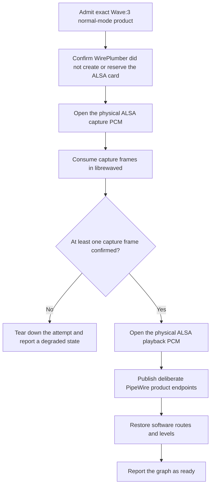

# Linux audio integration

Status: the ownership policy and capture-first lifecycle contract are implemented. The direct ALSA and PipeWire backend is not implemented.

## Reference system

The first test system uses Fedora 44, PipeWire 1.6, WirePlumber 0.5, KDE Plasma, and a Wave:3. Tests cover Wayland and X11 where desktop behavior differs.

## Validated ownership boundary

Some Wave microphones produce silent capture when playback starts before capture. A local workaround confirmed the required order by keeping capture active through a null sink and creating a replacement playback sink. That workaround is useful evidence, but it is not the product design. The null sink is visible to users, and a Lua script owns its lifecycle.

LibreWave uses one physical audio owner. `librewaved` will open the Wave:3 ALSA capture PCM directly, consume capture frames, confirm that capture is active, and then open the playback PCM. WirePlumber must not create or reserve the admitted physical card. PipeWire will carry only the product endpoints that `librewave-core` defines.

The repository now contains typed policy artifacts, prerequisites, and the ordered ownership plan in `librewave-platform-linux`. These types render files for setup and define the contract for the future ALSA and PipeWire adapter. They do not install files, open PCMs, create PipeWire objects, or change the running audio graph.

## WirePlumber policy

The Wave:3 policy renders `80-librewave-wave3.conf` as a WirePlumber 0.5 SPA-JSON fragment. Its one rule matches both exact normal-mode USB properties:

```text
device.vendor.id = "0x0fd9"
device.product.id = "0x0070"
```

The rule sets only `device.disabled = true`, which disables the exact card in the WirePlumber ALSA monitor. The fragment does not set `node.disabled`, create a node, load a component, or run a Lua script.

WirePlumber documents `device.disabled` as the property that removes a matched card or device. See the [WirePlumber ALSA configuration reference](https://pipewire.pages.freedesktop.org/wireplumber/daemon/configuration/alsa.html).

The rule has no serial, name, family, class, or regular-expression match. A different vendor ID or adjacent product ID does not match it. Setup, `librewavectl doctor`, and hardware validation must confirm that WirePlumber created no physical nodes and holds no reservation before `librewaved` takes ownership.

## Device access policy

The Wave:3 policy also renders `70-librewave-wave3.rules`. The udev rule matches the USB device object with vendor `0fd9` and product `0070`, then adds `TAG+="uaccess"`.

The rule does not use `MODE="0666"`. It does not match a USB class or interface, and it does not grant access to DFU or another product mode. `snd_usb_audio` stays bound during normal operation.

## Runtime ownership plan

The direct backend must follow this one startup path:



The daemon must not open playback when capture is inactive or has produced no frames. A failed step tears down objects from that attempt and reports a named degraded state. Recovery after hotplug or a PipeWire or WirePlumber restart uses the same sequence.

The current lifecycle state machine enforces this order through a host trait. It has no production host implementation yet, so it cannot touch ALSA or PipeWire.

## Product endpoints

The desktop may see only deliberate product endpoints. The current `librewave-core` contract defines microphone, monitor mix, and stream mix as public sources. Future sink flows must enter that core contract before the Linux adapter publishes them.

The physical Wave capture and playback PCMs are not desktop endpoints. LibreWave must not publish a keepalive sink, null sink, raw helper source, duplicate physical Wave node, or another implementation object as an ordinary device. KDE, `wpctl status`, and PulseAudio-compatible listings form the visibility acceptance test. Low-level diagnostic tools may still show internal objects needed to inspect the graph.

## Volume ownership

The Linux audio graph keeps these values separate:

- Microphone preamp gain is a Wave hardware value.
- Headphone output level is a Wave hardware value.
- LibreWave endpoint, channel, and mix volumes are software values.
- A raw ALSA hardware mixer value is not a LibreWave endpoint value.

KDE may change the software volumes that LibreWave publishes. It must not use ALSA hardware controls as those endpoint values. The device control path and accepted physical events remain the only routes to the microphone preamp and headphone level.

Gain Lock remains an optional Wave hardware setting. LibreWave reads and preserves it, and the user can change it through the hardware settings. Setup does not enable it. Gain Lock does not disable software volume on the LibreWave microphone endpoint.

Volume events carry an origin. A physical knob event can update hardware state and the UI without a write back to the device. A KDE software-volume event can update the matching LibreWave endpoint without reaching the ALSA hardware mixer. This avoids feedback loops and gives each value one owner.

The final mapping must also match the observed Wave Link behavior on Windows and macOS. See [Wave Link behavior parity](behavior-parity.md).

## Setup and removal

`librewavectl setup` will consume the typed artifact metadata and rendered policy text. It will show its plan, back up any user file that it replaces, install the WirePlumber fragment, install the systemd user service, and request elevation only for the udev rule.

This milestone does not implement those setup actions. The lifecycle contract in [Setup, development installs, and removal](setup.md) still governs installation, rollback, repair, and removal.

## Work still required

The direct ALSA and PipeWire backend needs a focused implementation and hardware test plan. Completion requires all of these results:

- `librewaved` owns the physical capture and playback PCMs directly.
- Capture consumption produces confirmed frames before playback opens.
- PipeWire source and sink directions come from `librewave-core`, and endpoint audio reaches the daemon-owned mixer.
- No helper, null sink, or physical Wave node appears as a desktop device.
- Restart, reconnect, sleep, login, teardown, and rollback tests pass on the reference system.
- Software volume changes cannot write microphone gain or headphone hardware level.

Do not claim Linux audio backend support until these tests pass.

## Acceptance tests

- Login with the Wave:3 already connected.
- Login with the Wave:3 disconnected, then connect it.
- Disconnect and reconnect during capture and playback.
- Restart PipeWire.
- Restart WirePlumber.
- Stop and restart `librewaved`.
- Change KDE microphone and output volumes.
- Change the physical Wave:3 knob in each control mode.
- Confirm that only deliberate endpoints appear in KDE and `wpctl status`.
- Confirm that saved microphone gain and headphone level survive every recovery case.
- Install a new development build over an older one and confirm that every running path refers to the new build.
- Uninstall and confirm that the original audio configuration is restored without a LibreWave process, unit, rule, or node.
