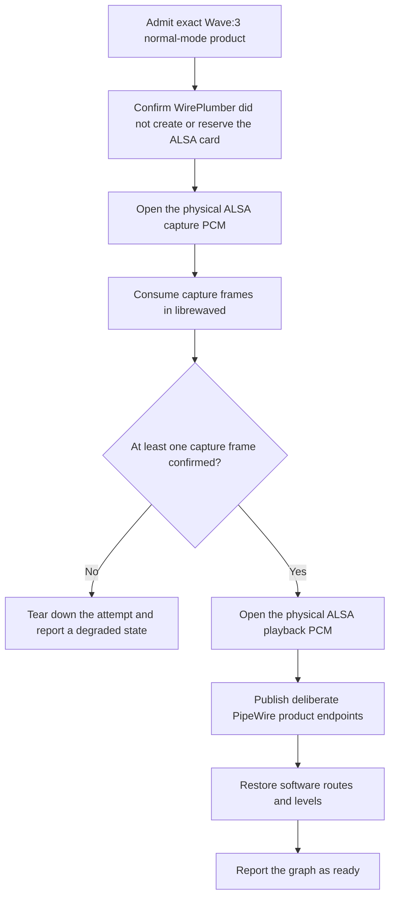

# Linux audio integration

Status: Stage 2 implements direction-specific ALSA capture and playback workers and composes them with the independent-clock bridge under deterministic fakes. The separate PipeWire graph seam also remains offline. The production host inspects PipeWire, then returns `GraphNotReady` before it selects or opens an ALSA PCM. No Stage 2 path opens live audio hardware.

## Reference system

The first test system uses Fedora 44, PipeWire 1.6, WirePlumber 0.5, KDE Plasma, and a Wave:3. Tests cover Wayland and X11 where desktop behavior differs.

## Validated ownership boundary

Some Wave microphones produce silent capture when playback starts before capture. A local workaround confirmed the required order by keeping capture active through a null sink and creating replacement playback and capture endpoints. A sanitized read-only PipeWire inspection confirmed that the null sink appears in the ordinary sink list beside the replacement endpoints. That workaround is useful evidence, but it is not the product design. A Lua script owns its lifecycle.

LibreWave uses one physical audio owner. `librewaved` will open the Wave:3 ALSA capture PCM directly, consume capture frames, confirm that capture is active, and then open the playback PCM. WirePlumber must not create or reserve the admitted physical card. PipeWire will carry only the product endpoints that `librewave-core` defines.

`librewave-platform-linux` contains the policy artifacts, ordered lifecycle, and direct host. The host uses `alsa` 0.12.1 and `pipewire` 0.9.2. The PipeWire Rust crate does not wrap `pw_filter`. A small C shim includes the installed PipeWire headers and owns only the ABI-sensitive filter event, hook, and process-position layouts. Rust owns graph policy, lifecycle, validation, and processing. None of this code is connected to daemon startup, setup, or the running graph.

The host correlates an admitted USB candidate to one ALSA card. It requires one stable ALSA card identifier and one PCM device for each direction. It repeats the sysfs and procfs correlation immediately before each open. The open uses the revalidated card identifier, device number, and subdevice zero. A changed card number, identifier, topology, or PCM set stops startup.

Wave:3 has one admitted physical PCM mode. Capture uses interleaved packed signed S24_3LE, one channel, and exactly 48 kHz. Playback uses interleaved packed signed S24_3LE, two channels, and exactly 48 kHz. Capture and playback have independent period and buffer values. Each value must be nonzero, and each period must not exceed its buffer. Frame, sample, and byte calculations use checked arithmetic. ALSA must apply the full configuration without adjustment.

## WirePlumber policy

The Wave:3 policy renders `80-librewave-wave3.conf` as a WirePlumber 0.5 SPA-JSON fragment. Its one rule matches both exact normal-mode USB properties:

```text
device.vendor.id = "0x0fd9"
device.product.id = "0x0070"
```

The rule sets only `device.disabled = true`, which disables the exact card in the WirePlumber ALSA monitor. The fragment does not set `node.disabled`, create a node, load a component, or run a Lua script.

WirePlumber documents `device.disabled` as the property that removes a matched card or device. See the [WirePlumber ALSA configuration reference](https://pipewire.pages.freedesktop.org/wireplumber/daemon/configuration/alsa.html).

The rule has no serial, name, family, class, or regular-expression match. A different vendor ID or adjacent product ID does not match it. The current setup does not install or activate this rule. A future setup can install it only after the production audio host can take ownership. Hardware validation must then confirm that WirePlumber created no physical nodes and holds no reservation before `librewaved` takes ownership.

## Device access policy

The Wave:3 policy also renders `70-librewave-wave3.rules`. The udev rule matches the USB device object with vendor `0fd9` and product `0070`, then adds `TAG+="uaccess"`.

After it installs or removes this rule, the lifecycle reloads the udev rules. It then sends a change event only to normal-mode Wave:3 USB device objects with the same vendor and product values. It does not use a broad USB trigger. If the privileged rule or refresh operation fails, the lifecycle fails and does not claim that access is current. Rollback or journal recovery preserves or restores the prior rule state.

The rule does not use `MODE="0666"`. It does not match a USB class or interface, and it does not grant access to DFU or another product mode. `snd_usb_audio` stays bound during normal operation.

## Runtime ownership plan

The direct backend must follow this one startup path:



The daemon must not open playback when capture is inactive or has produced no frames. A failed step tears down objects from that attempt and reports a named degraded state. Recovery after hotplug or a PipeWire or WirePlumber restart uses the same sequence.

The lifecycle state machine enforces capture progress before playback preparation through one host trait. In Stage 2, the production host stops after PipeWire graph inspection because the production graph does not yet own the bridge. It does not select or open an ALSA PCM. Fake composition covers the remaining order without accessing live audio resources.

The capture worker owns one capture PCM and one `CaptureIngress`. It allocates its packed period buffer before the thread starts. Each completed read enters one capture boundary. The boundary advances the checked application ledger by the number of returned frames and stays in flight through status sampling and publication. The worker then gets one safe status snapshot for timestamp, availability, and signed delay. It reads the raw PCM state separately because `alsa` 0.12.1 does not provide a checked state value through `Status`. ALSA can advance between those two calls, so the fault gate has a small sampling skew. The worker publishes exactly the returned prefix after all checks pass. If the short priming gate starts first, the worker retains the prefix and retries the same boundary. It does not read or account for those frames again.

The playback worker owns one playback PCM, one `PlaybackEgress`, and its submitter. It can stay parked while the PCM is prepared. ALSA timestamp mode uses `CLOCK_MONOTONIC`, and playback uses the software boundary as its start threshold. Both settings must read back exactly. After real Monitor Mix is queued under fakes, thread activation is allowed. The submitter accepts one complete packed stereo period, including bounded partial writes, before the worker calls `snd_pcm_start` explicitly.

A finite ALSA wait that reports no readiness is a cancellation and no-progress point. It is not a worker fault. `EAGAIN` and `EINTR` use bounded retry counts with cancellation checks. `EPIPE`, `ESTRPIPE`, disconnect, invalid state, invalid geometry, timestamp regression, overflow, and other fatal errors end the attempt. The worker does not call ALSA recovery. A later supervisor must tear down the full attempt and restart it from capture.

Worker shutdown first requests cancellation, then joins the thread. The returned thread state contains the sole PCM owner. On the control thread, that owner calls `snd_pcm_drop` through the safe wrapper and reports the stream-drop result. The wrapper is then destroyed on the same thread, and its RAII implementation releases the ALSA handle. `alsa` 0.12.1 does not report the result of the underlying `snd_pcm_close` call. The callback-reachable graph path does not own or release ALSA resources.

## Product endpoints

The desktop may see only these deliberate product endpoints:

| Endpoint ID | Display name | PipeWire node name | Flow | PipeWire direction | Media class |
| --- | --- | --- | --- | --- | --- |
| `System` | System | `librewave.system` | Public sink | Input | `Audio/Sink` |
| `Microphone` | Microphone | `librewave.microphone` | Public source | Output | `Audio/Source` |
| `MonitorMix` | Monitor mix | `librewave.monitor-mix` | Public source | Output | `Audio/Source` |
| `StreamMix` | Stream mix | `librewave.stream-mix` | Public source | Output | `Audio/Source` |

All four plans set `node.virtual=true`. Applications render to the System sink. Its frames supply the engine's System logical source. Physical Wave:3 capture supplies the Microphone logical source. The engine produces only Microphone, Monitor Mix, and Stream Mix output buffers. The System sink does not increase the engine output count. Monitor Mix is also the intended signal for physical headphone playback.

The physical Wave capture and playback PCMs are not desktop endpoints. LibreWave must not publish a keepalive sink, null sink, raw helper source, duplicate physical Wave node, or another implementation object as an ordinary device. KDE, `wpctl status`, and PulseAudio-compatible listings form the visibility acceptance test. Low-level diagnostic tools may still show internal objects needed to inspect the graph.

The host connects to the user's existing PipeWire instance and completes a registry round trip. It checks the admitted candidate's exact ALSA card number. A Device global must have the Wave:3 vendor and product values, and its `api.alsa.card` value must identify that card. A Node global matches through the card component of `api.alsa.path`. Node globals do not need vendor or product properties. Startup fails while any matching Device or Node global remains visible.

Endpoint plans come only from `librewave-core`. The production adapter returns `EndpointStreamTransportUnavailable` before it opens ALSA or creates an endpoint, and it records the matching `GraphNotReady` reason. It does not publish silence or report the graph as ready. The offline graph seam is not a production publication path. Under fakes, the ALSA workers produce the typed observations for both physical directions and compose with the portable bridge. The production host does not yet own that composition.

## Offline PipeWire graph seam

The crate contains a private five-node graph seam. It exists to verify PipeWire scheduling and ownership. The seam has no call path from the production host.

The System `Audio/Sink` node is the PipeWire driver. Its permanent monitor links keep the graph active when no application renders to System. Microphone, Monitor Mix, and Stream Mix are `Audio/Source` nodes. A fifth node owns the mixer callback and eight planar F32 ports. That node has no `Audio/Sink` or `Audio/Source` media class. The client creates all five nodes and all eight permanent links while the filter is inactive, validates the observed graph, and activates the filter once. It does not create a hidden driver, timer, server configuration, lingering object, or helper endpoint.

One callback receives the graph driver ID, rate, position, quantum, two System input buffers, and six output buffers. The callback accepts 48 kHz and one fixed quantum for an attempt. A missing buffer, PipeWire error or disconnect, pause, driver change, rate change, quantum change, position discontinuity, overlapping or invalid buffer range, processor error, or panic fails that attempt. A fixed-capacity atomic record carries fault details to the control thread. The callback does not tear down the graph.

System link state uses a generation published from registry events. A producer attach has one priming quantum. A detach has one valid drain quantum, then System becomes semantic silence. The test removes producer links before it deactivates the producer. This order preserves the adapter tail and prevents stale samples from entering a later idle cycle.

The explicit integration test starts its own PipeWire daemon. It uses temporary runtime and configuration directories and a private remote name. It does not use WirePlumber, ALSA, USB, user services, or persistent configuration. The test repeats the full lifecycle at fixed quanta of 64, 128, 256, and 512 frames. It verifies the four endpoint classes, the hidden filter, all eight F32 ports, one System driver ID, continuous graph position, deterministic mixer vectors, idle processing, producer and consumer churn, one priming quantum, one drain quantum, and zero residual LibreWave objects. System input has exactly one quantum of adapter latency. Filter output reaches all three source adapters in the same graph cycle.

A separate test changes the live quantum from 128 to 64 frames. PipeWire pauses the filter before it delivers a block with the new quantum. The seam records that pause as an attempt fault and tears down the graph. It does not claim seamless live quantum changes.

Run the integration gate only on a host with the PipeWire development files, `pipewire`, `pw-cli`, and `pw-metadata`:

```text
LIBREWAVE_PIPEWIRE_INTEGRATION=1 cargo test -p librewave-platform-linux audio_host::pipewire_graph::tests::integration::private_pipewire_graph -- --ignored --exact --test-threads=1
```

The default test suite does not start a daemon and does not silently skip this gate. CI does not run the gate yet because the current runner contract does not install the PipeWire daemon tools. Add it when CI supplies a fixed PipeWire runtime image and runs the command as a separate serial job.

## Portable mixer contract

`librewave-engine` processes stereo interleaved 32-bit float audio at 48 kHz. Construction sets a portable logical source collection with a maximum of 12 sources. It also sets the microphone source and the maximum frames that one call can process. Each call can use a different frame count at or below that maximum. The Linux adapter is responsible for bridging ALSA periods and PipeWire quantum sizes to this contract.

Each source has separate monitor and stream routes. A route has an enabled value and a fader from -60.0 dB through +12.0 dB in 0.5 dB steps. The microphone endpoint receives the configured microphone source at unity. Monitor and stream route values do not change that endpoint. Hardware microphone gain, hardware microphone mute, and headphone level stay outside the engine.

The engine reports separate left and right peak and RMS values for each source and endpoint. It applies one complete pending control snapshot at the boundary before a nonzero block. Processing uses fixed-capacity state and does not allocate, free memory, lock, block, log, perform I/O, or call platform code.

## Offline graph-clock bridge

The offline bridge models three independent clocks: Wave capture, the PipeWire graph, and Wave playback. It does not infer a shared clock for the two Wave directions. The PipeWire graph position is the only clock for `MixerEngine`. System remains a direct graph-time input. Microphone, Monitor Mix, and Stream Mix remain direct graph-time outputs.

Every clock sample uses a typed nonzero attempt epoch, an integer frame position, and integer nanoseconds from a monotonic clock. It does not use wall time or a floating-point timestamp. A graph observation also has a positive quantum. The Linux graph processor accepts one fixed quantum for each attempt. That fixed-quantum rule is Linux policy. The portable estimator accepts arbitrary positive frame and time deltas within caller-selected bounds.

The capture side accepts a checked capture observation, a complete frame count, and mono packed S24_3LE data. `CaptureIngress` keeps a separate application frame ledger. The observed hardware position must be at or beyond the completed application position. A greater hardware position is valid because ALSA capture availability can contain unread frames. A hardware position behind the application position faults the attempt before the FIFO, application ledger, last observation, or observation handoff changes. The decoder sign-extends each 24-bit value and produces finite mono `f32` samples.

The capture worker publishes complete blocks to a bounded single-producer, single-consumer FIFO. It also offers checked observations to a one-slot handoff. The handoff never overwrites an unread observation. If the slot is full, the new observation is not published. The graph processor consumes an observation only when its full boundary can commit.

The graph processor has one lifecycle-driven `process` boundary for startup and active work. It copies the required capture frames into preallocated scratch without advancing the published read sequence. Its capture-to-graph estimator measures `graph_rate / capture_rate` as `(graph_frames * capture_nanoseconds) / (capture_frames * graph_nanoseconds)`. Checked `u128` cross-products precede the floating-point division. The estimator preview does not change history.

The playback side takes the stereo Monitor Mix output from the same graph boundary. The graph processor offers each graph observation to another one-slot, no-overwrite handoff and publishes Monitor Mix to the playback FIFO. `PlaybackEgress` has one lifecycle-driven `process` boundary. Its independent graph-to-playback estimator measures `playback_rate / graph_rate` as `(playback_frames * graph_nanoseconds) / (graph_frames * playback_nanoseconds)`.

Each direction owns one estimator, one FIFO phase controller, and one rate matcher. The controller requires a measured feed-forward ratio after estimator priming. It computes `final_ratio = measured_feed_forward * fifo_phase_trim`, then applies the final-ratio slew and bounds. Invalid measurements, non-finite arithmetic, and policy violations fault the attempt. The code does not clamp them or replace them with 1.0. The controller's `ratio()` value is the final ratio applied to the matcher.

FIFO ownership is fixed. `CaptureIngress` is the sole capture producer, and `GraphClockProcessor` is its sole consumer. `GraphClockProcessor` is the sole playback producer, and `PlaybackEgress` is its sole consumer. Each FIFO has monotonic published read and write frame sequences. These sequences are the only source for fill and free-space values. A producer copies a complete block before a commit publishes the next write sequence. A consumer can copy a complete block without publishing the next read sequence. Dropping either prepared operation leaves its sequence unchanged.

Construction verifies both sides of each FIFO operating range. The low-water guard must contain the matcher's maximum input. At the high-water guard, the capture FIFO must have space for one full physical capture period. The playback FIFO must have space for one maximum graph quantum. Construction uses checked arithmetic and fails before processing if either proof does not hold.

The graph processor commits the capture FIFO, capture observation, graph observation, capture estimator, capture controller, and graph position only after capture ASRC, mixer processing, finite output validation, and complete Monitor Mix admission to the playback FIFO all succeed. `PlaybackEgress` commits its FIFO, graph observation, playback estimator, playback controller, and hardware observation only after a complete packed period reaches the submitter. If a terminal write follows partial acceptance, only the playback application ledger advances by the accepted frames. The FIFO and estimator transaction does not commit. The attempt then faults. A matcher can change internal state before a later boundary fails. Such a failure is terminal, so the attempt cannot retry with partially changed dependency state.

Playback submission and playback hardware movement are separate facts. A successful submitter call advances only the application frame ledger. The next safe status snapshot supplies the next playback observation. The worker does not attach a post-write status to the completed submission cycle. During active processing, repeated or regressing hardware progress faults the attempt. The playback code does not infer hardware progress from a successful submission and does not parse the USB feedback endpoint.

For capture, `capture_ring_hw = capture_appl_total + capture_avail`. The result must not precede completed application progress. For playback, `queued_ring_frames = buffer_frames - playback_avail`, then `playback_ring_hw = playback_appl_total - queued_ring_frames`. Availability must fit the exact configured buffer. Signed ALSA delay remains separate diagnostic data and can be negative. Seconds, nanoseconds, and all position conversions use checked arithmetic.

The startup states are `Allocated`, `CapturePriming`, `CaptureFilterDelay`, `CaptureEstimatorPriming`, `PlaybackPriming`, `PlaybackFilterDelay`, `PlaybackEstimatorPriming`, `PlaybackStabilizing`, `PrimingCheck`, and `Primed`. `PrimingCheck` is a short atomic gate. It prevents new processing boundaries while the playback owner checks that no earlier capture or graph boundary is in flight. The owner then gets both fill values from stable published sequences. It returns to `PlaybackStabilizing` if either fill is outside its guard. Activation uses the same gate to verify that all three owners are outside a boundary.

The matcher ratio is exactly 1.0 only in the named filter-delay and estimator-priming states. The applicable controller does not preview or commit in those states. An estimator can commit explicit priming observations, but it does not invent a measured ratio. If a dependency delay ends inside a graph quantum or playback period, the bridge discards that complete boundary. It does not trim a boundary. Complete playback boundaries remain startup work in `PlaybackStabilizing` until both FIFO guards and observed hardware progress permit `Primed`. No delay discard occurs in `Primed` or `Active`.

`Primed` means that offline startup checks are complete. It does not mean that a production endpoint or PCM path is ready. Both fake workers park at this state without starting another boundary, but they keep sole ownership of their PCM and bridge endpoint. After the control owner changes the bridge to `Active`, it resumes both worker threads. A stop request also wakes a parked worker. A fault moves the attempt to `Faulted`. Teardown moves it to `Quiescing`, waits for the capture, graph, and playback owners to leave their boundaries, then moves it to `Stopped`.

An unconnected System endpoint has semantic silence. A connected System endpoint must supply two complete, finite graph-time buffers. Missing active System data is a fault. Missing capture or playback bridge data is also a fault. Other terminal faults include FIFO overflow, unsupported or adjusted physical format, invalid quantum or period, packed sample errors, position overflow or discontinuity, estimator or controller failure, ASRC failure, submission failure, incomplete submission, and teardown before quiescence. The active path has no sample drop, sample insertion, fixed-ratio fallback, or unbounded queue.

Construction allocates and warms both rate matchers, audio scratch, FIFOs, observation handoffs, the control handoff, the meter handoff, and the packed playback buffer. The graph boundary does not allocate, deallocate, block, log, perform USB or file I/O, create a thread, panic, or acquire an unbounded lock. Mixer changes use the bounded control stager. Meter reports use the bounded, nonblocking handoff.

Tests choose FIFO capacities, guard values, estimator spans, controller gains, and ratio bounds as named simulation values. These values are not product policy. One checked frame-ledger and controller simulation covers 24 simulated hours in both drift directions. A shorter test runs real mono and stereo sinc ASRC with independent positive and negative drift. The frame ledger tests arithmetic and control stability only. It does not validate sinc sample quality. Other tests cover every graph quantum from 64 through 1024 frames, including non-multiple values, packed S24_3LE conversion, sample order, startup delay, clock faults, transaction commit rules, zero realtime allocation or deallocation, and quiescent teardown. Worker fakes also cover partial reads and writes, bounded transient retries, wait timeouts, signed delay, timestamp conversion, terminal ALSA states, explicit playback start order, deterministic parking and resume, stream drop, and RAII handle release.

The workers and bridge compose only under fakes. They are not called by daemon startup or the PipeWire graph seam. They do not install policy, publish a host node, or access live hardware in the default test suite. Production work must compose the existing owners with the PipeWire callback and add control-side startup and progress watchdogs. The production resource state remains `GraphNotReady`.

## Mixer control plane

The current product profile has two logical sources. Source 1 is Microphone, and source 2 is System. Source 1 supplies the microphone endpoint. Each source starts with its monitor and stream routes enabled at 0 dB. Levels use integer half-decibel steps from -60 dB through +12 dB.

`librewaved` stores the desired profile in `librewave/profiles/mixer-state.json` under the selected configuration root. Schema 1 contains the mixer generation, microphone source, and the complete two-source profile. The daemon rejects unknown fields, unsupported schemas, changed source identities, and invalid fader steps. It does not read an older mixer format or add an Auxiliary source.

`librewavectl mixer show` reads the current snapshot. `librewavectl mixer set <source-id> <generation> <monitor|stream> <on|off> <level-db>` replaces one complete route. The daemon rejects a stale mixer generation or an unknown source. An unchanged route succeeds without a file write or generation change.

For a changed route, the daemon writes the complete desired profile to a temporary file, syncs it, renames it, and syncs the profile directory. It updates retained state only after all these steps succeed. If the directory sync fails after the rename, the command reports durability ambiguity and retained state does not advance. The destination can already contain the next complete profile. A retry with the retained generation writes the same next profile and converges the file and snapshot. On startup, the daemon strictly loads whichever complete file is present.

The mixer snapshot reports that the audio host and mixer engine are not connected. Meter values are unavailable. These controls are durable desired state only. They do not start ALSA, create PipeWire objects, enable the daemon service, or make the Linux audio graph ready.

## Volume ownership

The Linux audio graph keeps these values separate:

- Microphone preamp gain is a Wave hardware value.
- Headphone output level is a Wave hardware value.
- LibreWave endpoint, channel, and mix volumes are software values.
- A raw ALSA hardware mixer value is not a LibreWave endpoint value.

KDE may change the software volumes that LibreWave publishes. It must not use ALSA hardware controls as those endpoint values. The device control path and accepted physical events remain the only routes to the microphone preamp and headphone level.

A sanitized read-only ALSA inspection found `Mic Capture Volume` at 0.00 to 40.00 dB in 0.5 dB steps and `PCM Playback Volume` at -60.00 to 0.00 dB in 0.5 dB steps. Their switches and read-only channel maps belong to the same physical control groups. These controls are hardware aliases for microphone gain and headphone level. LibreWave must keep them out of software endpoint volume and mute semantics.

Gain Lock remains an optional Wave hardware setting. LibreWave reads and preserves it, and the user can change it through the hardware settings. Setup does not enable it. Gain Lock does not disable software volume on the LibreWave microphone endpoint.

Volume events carry an origin. A physical knob event can update hardware state and the UI without a write back to the device. A KDE software-volume event can update the matching LibreWave endpoint without reaching the ALSA hardware mixer. This avoids feedback loops and gives each value one owner.

The final mapping must also match the observed Wave Link behavior on Windows and macOS. See [Wave Link behavior parity](behavior-parity.md).

## Setup and removal

`librewavectl setup` shows its plan before it changes the system. It stages the current CLI and daemon, switches stable links, installs an inactive daemon unit, and requests elevation only for the exact udev access rule.

Setup does not install or reload the WirePlumber fragment. It does not enable the unit, start the daemon, open ALSA, or publish PipeWire objects. `librewavectl doctor` reports production audio ownership as blocked and graph inspection as not implemented. The host resource snapshot is not yet part of daemon reconciliation or doctor output. The lifecycle contract in [Setup, development installs, and removal](setup.md) governs installation, rollback, diagnostics, and removal.

## Work still required

The portable ASRC bridge and the two ALSA worker directions are implemented and tested offline. Production graph composition, control-side watchdogs, and host wiring remain required. Completion requires all of these results:

- `librewaved` owns the physical capture and playback PCMs directly.
- Capture consumption produces confirmed frames before playback opens.
- Native ALSA capture and playback status behavior matches the safe API assumptions used by the typed observations.
- PipeWire source and sink directions come from `librewave-core`, and endpoint audio reaches the daemon-owned mixer.
- No helper, null sink, or physical Wave node appears as a desktop device.
- Restart, reconnect, sleep, login, teardown, and rollback tests pass on the reference system.
- Software volume changes cannot write microphone gain or headphone hardware level.

Native validation must confirm PCM timestamp, availability, delay, state, partial I/O, and disconnect behavior on the reference system. `EPIPE` and `ESTRPIPE` are terminal attempt faults. Recovery must release the failed attempt and use the full capture-first startup sequence.

Do not claim Linux audio backend support until these tests pass.

## Acceptance tests

- Login with the Wave:3 already connected.
- Login with the Wave:3 disconnected, then connect it.
- Disconnect and reconnect during capture and playback.
- Restart PipeWire.
- Restart WirePlumber.
- Stop and restart `librewaved`.
- Change KDE microphone and output volumes.
- Change the physical Wave:3 knob in each control mode.
- Confirm that only deliberate endpoints appear in KDE and `wpctl status`.
- Confirm that saved microphone gain and headphone level survive every recovery case.
- Install a new development build over an older one and confirm that every running path refers to the new build.
- Uninstall and confirm that manifest-owned paths are removed, replaced files are restored, profiles are preserved, and no LibreWave process, unit, rule, or node remains.
